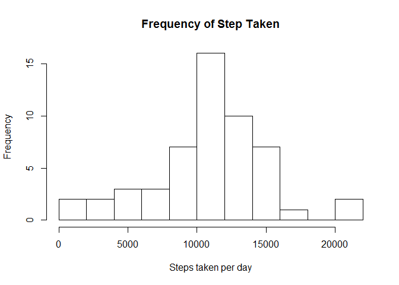
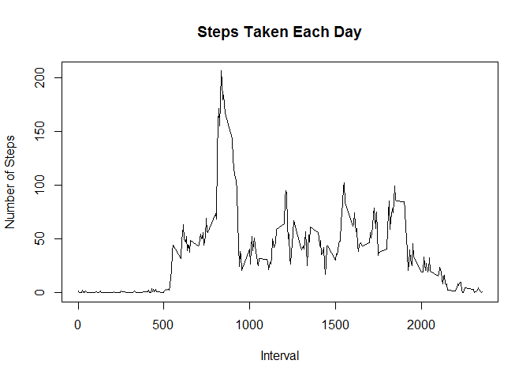
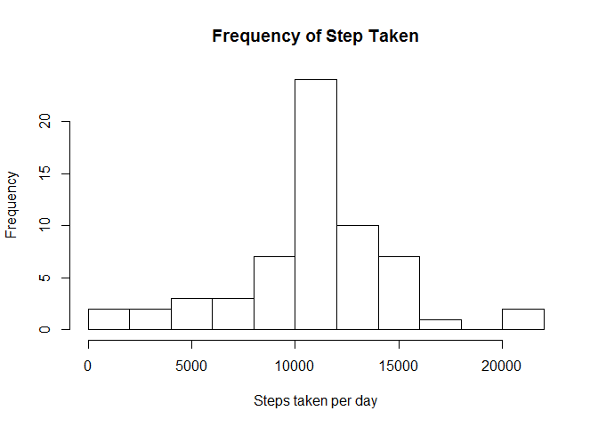
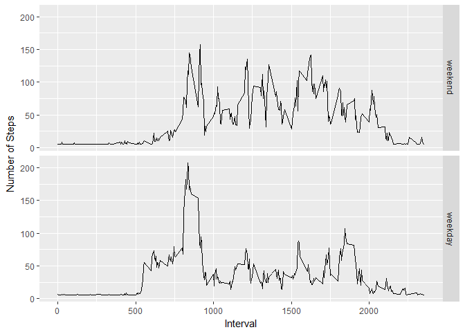

# Reproducible Research: Peer Assessment 1


## Loading and preprocessing the data


```r
activity <- read.csv("activity.csv", stringsAsFactors = FALSE)
activity[,2] <- as.Date(activity[,2], "%Y-%m-%d")
```

## What is mean total number of steps taken per day?

### Total number of steps taken perday 

```r
sum.steps <- aggregate(steps~date, activity, FUN=sum)
head(sum.steps)
```

```
##         date steps
## 1 2012-10-02   126
## 2 2012-10-03 11352
## 3 2012-10-04 12116
## 4 2012-10-05 13294
## 5 2012-10-06 15420
## 6 2012-10-07 11015
```

### Histgram of the total number of steps taken each day

```r
#Histgram of the total number of steps taken each day
hist(sum.steps$steps,breaks=10, main="Frequency of Step Taken",xlab="Steps taken per day")
```

<!-- -->

###Mean of the total number taken per day 

```r
mean.sum.steps <- mean(sum.steps[,2], na.rm=TRUE)
print(mean.sum.steps)
```

```
## [1] 10766.19
```

###Median of the total number taken per day 

```r
median.sum.steps <- median(sum.steps[,2], na.rm=TRUE)
print(median.sum.steps)
```

```
## [1] 10765
```

## What is the average daily activity pattern?

### Time Series Plot

```r
mean.interval.steps <- aggregate(steps~interval, activity, FUN=function(x) mean(x, na.rm=TRUE))

plot(mean.interval.steps[, 1], mean.interval.steps[,2], type="l", xlab = "Interval", ylab = "Number of Steps", main = "Steps Taken Each Day")
```

<!-- -->

### Maximum number of steps

```r
activity[which.max(activity[,1]), 3]
```

```
## [1] 615
```


## Imputing missing values

###Number of missing value

```r
sapply(activity, function(x) sum(is.na(x)))
```

```
##    steps     date interval 
##     2304        0        0
```

### Fill the missing value with the mean of steps takeneach day

```r
#average steps each day
mean.steps <- aggregate(steps~date, activity, FUN=(function(x) mean(x)), na.action = NULL)
#Fill the missing value of average steps each day with the mean of the average steps taken each day
mean.steps[is.na(mean.steps$steps),]$steps <- mean(mean.steps$steps, na.rm=TRUE)

#replace the missing value for each interval with the average steps each day.
clean.activity <- activity 
for (i in 1:nrow(clean.activity)) {
        if(is.na(clean.activity[i, 1])){
                clean.activity[i, 1] <- mean.steps[which(mean.steps$date==clean.activity[i, 2]), 2]
        }
                
}
```
###New dataset

```r
head(clean.activity)
```

```
##     steps       date interval
## 1 37.3826 2012-10-01        0
## 2 37.3826 2012-10-01        5
## 3 37.3826 2012-10-01       10
## 4 37.3826 2012-10-01       15
## 5 37.3826 2012-10-01       20
## 6 37.3826 2012-10-01       25
```

###Histgram of the total number of steps taken each day 

```r
sum.clean.steps <- aggregate(x = clean.activity[, 1], by=list(clean.activity[, 2]), FUN=(function(x) sum(x, na.rm = FALSE)))
hist(sum.clean.steps[,2], breaks = 10, main="Frequency of Step Taken",xlab="Steps taken per day")
```

<!-- -->

###Mean of the total number taken per day 

```r
mean.sum.clean.steps <- mean(sum.clean.steps[,2], na.rm=TRUE)
print(mean.sum.clean.steps)
```

```
## [1] 10766.19
```

###Median of the total number taken per day 

```r
median.sum.clean.steps <- median(sum.clean.steps[,2], na.rm=TRUE)

print(median.sum.clean.steps)
```

```
## [1] 10766.19
```
## Are there differences in activity patterns between weekdays and weekends?

###Create weekday variables

```r
wdays<- c('Monday', 'Tuesday', 'Wednesday', 'Thursday', 'Friday')
clean.activity$weekdays <- factor((weekdays(clean.activity$date) %in% wdays), levels = c(FALSE, TRUE), labels=c("weekend", "weekday"))
```
###plot 

```r
require(ggplot2)
```

```
## Loading required package: ggplot2
```

```r
mean.clean.interval.steps <- aggregate(steps~interval+weekdays,clean.activity, FUN=(function(x) mean(x)))

qplot(interval, steps, data=mean.clean.interval.steps, facets=weekdays~.,geom = "line", xlab = "Interval", ylab = "Number of Steps")
```

<!-- -->


